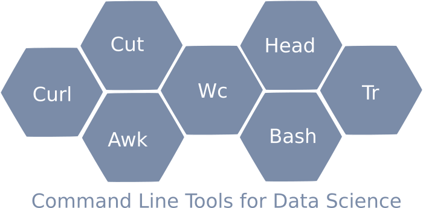

# Academy-Course-DAT31076

## Working with Large Matrices using Command Line Tools

This course is an Open Risk Academy CrashCourse introduction to using Linux command line tools to work (in particular) with large text files encoding numerical data in matrix format. A central role is played by **awk**, the venerable UNIX pattern-matching language and tool.

The course is live at the [Open Risk Academy](https://www.openriskacademy.com/course/view.php?id=76). This repository hosts various **bash** and **awk** scripts used in the course.

## Motivation for the Course

The motivation for the Course is that various matrix data manipulations are cumbersome in spreadsheets while using a statistical programming environment based e.g., on Python or R might be an overkill in terms of the overhead involved. We illustrate how common tasks can be performed using simple command line tools and scripts.

## Course Objectives

The objective of the course is to provide a first acquaintance with text-oriented command-line data science tasks.

* Bash scripting
* Several basic CLI commands (ls, cd, etc.)
* file manipulation oriented CLI commands such as head, cut, wc
* the awk programming language and scripting

## Pre-Requisites

Basic knowledge of and a working setup of a Linux or Linux-like development environment (including working with a shell and a text editor) is essential. Any standard Linux distribution should work (Using WSL on Windows machines) and MacOS as well (possibly with the installation of GNU tools).

Some exposure to scripting and any general purpose programming language (E.g., Python, Javascript, C++, Java) is required for understanding the scripts and work through the **awk** exercises.

The course derives motivation from the large matrix data processing task. Hence, some idea of what a matrix *is* and why it is relevant to know how to work with them is assumed, but it is not required for completing the course as we do now go into any mathematical aspects of matrices.

## Table of Contents

## Step 1
* Motivation for Command Line tools
* Overview and Setup of CLI Tools
* A hello world in Awk

## Step 2
* Downloading Data: Using command line tools to get published matrix data stored in local disk
* Extracting Data: verify we have downloaded correct datasets and (if necessary) bring to a shape that makes it usable (e.g. uncompressing it)

## Step 3
* Scanning Data Files: get a first high level view of what sort of files we have downloaded
* Figuring out Structure and Dimensions: understand structure of the file (separators, total number of rows and columns involved and their nature).

## Step 4
* Scrubbing / Cutting / Reshaping: create clean files where matrix data with a known number of rows and columns are stored in tab separated ascii format.
* Transformations: Perform simple mathematical transformations and statistical operations. Investigate the degree to which matrix values are non-trivial (non-zero)

## Course Exercises

The exercises concern writing small bash or awk scripts that accomplish a certain task. Indicative solutions are provided in this repository.

